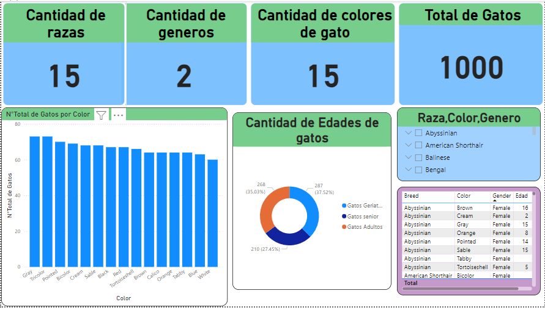

# Mi primer informen en Power Bi sobre una base de datos de gatos

# BASE DE DATOS :
El presente informe tiene una base de datos de 1000 gatos donde los campos son:Raza,Color,Genero,Edad y Peso.
# Explicacion breve:

Utilize power bi para poder analisar los datos desarrollados por un conjunto de base da datos de la pagina Kaggle,resaltando que son de la vida real,esto es para poder transformar los datos en visualizaciones interactivas y detalladas.

En la presente imagen se aprecia como primera instancia los rasgos importantes que se debe tener encuenta de cada gato(Raza,Genero,Color y cantidad total ),se aplico la segmentacion de datos para poder ubicar de manera mas facil cada caracteristica importante del gato seleccionado para las cualidades que se eligan en las opciones.

Se añadio un grafico circular con medidas nuevas respecto a las edades de los gatos:
# Gatos Adultos(2-6 años):
Su energía y salud suelen ser óptimas, y presentan un comportamiento más equilibrado en comparación con los gatos jóvenes.
# Gatos Senior(11-14 años):
Comienzan a disminuir su actividad física y pueden desarrollar problemas de salud relacionados con la edad, como artritis, problemas dentales o enfermedades renales.
# Gatos Geriaticos(15+ años):
Son más propensos a enfermedades crónicas y su sistema inmunológico está debilitado.

Para el desarrollo de estas se aplico funciones del formato o el lenguaje DAX.

Para ambitos financieros,dependiendo de la condicion de cada gato,se pueden utilizar para fines economicos,vendiendo a cada cliente el tipo de gato que desea.Dependiendo de las cualidades de este,se pueden usar tambien  para competencias deportivas,shows de recreacion y demas actividades que impliquen el uso de animales entrenados.

